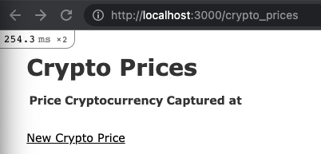

<!-- START doctoc generated TOC please keep comment here to allow auto update -->
<!-- DON'T EDIT THIS SECTION, INSTEAD RE-RUN doctoc TO UPDATE -->
**Table of Contents**  *generated with [DocToc](https://github.com/thlorenz/doctoc)*

- [Adding a User Resource to a Rails Application](#adding-a-user-resource-to-a-rails-application)
  - [Designing Data Models](#designing-data-models)
    - [Context](#context)
    - [Identifying Entities](#identifying-entities)
    - [Demo: Identifying Entities](#demo-identifying-entities)
    - [Creating Resources](#creating-resources)
    - [Demo: References](#demo-references)
    - [Demo Relationships](#demo-relationships)
  - [Implementing Business Rules](#implementing-business-rules)
    - [Business Rules](#business-rules)
    - [Demo: Basic Validators](#demo-basic-validators)
    - [Database Layer](#database-layer)
    - [Demo: Custom Validators](#demo-custom-validators)
    - [Hacks and Hooks](#hacks-and-hooks)
    - [Demo Hacks and Hooks](#demo-hacks-and-hooks)
  - [Building an Application Prototype](#building-an-application-prototype)
    - [Scaffolding](#scaffolding)
    - [Demo Part 1: Scaffolding](#demo-part-1-scaffolding)
    - [Demo Part 2: Scaffolding](#demo-part-2-scaffolding)
    - [Demo: Prototyping](#demo-prototyping)

<!-- END doctoc generated TOC please keep comment here to allow auto update -->

# Adding a User Resource to a Rails Application

> My notes from Pluralsight [course](https://app.pluralsight.com/library/courses/adding-user-resource-rails-application/table-of-contents)

## Designing Data Models

### Context

* Create an information system to track a company's stock prices. eg: a publicly traded company such as Tesla.
* Prices should be captured daily.
* Design for flexibility to store other company stock prices as well.

### Identifying Entities

First step in data modelling.

Entity: Noun or concept that reflects something in the real world.

Questions to ask to identify entities:

1. Who are the players in the narrative? (eg: `Company`). Think in a general mindset to make the model more flexible.
2. What information has to be stored? (eg: stock price per day). This creates another entity `StockPrice`.

**Candidate Data Models**

At this point, don't use Rails yet, just draw out boxes for each entity, eg: `Company` and `StockPrice`.


**Defining Attributes**

Define attributes and data types for each entity.


Possible data types are:

* string - alphanumeric characters
* integer - whole numbers
* decimal (float/long) - decimal numbers
* boolean - true or false
* text - longer strings
* date - a date value

Notice the naming convention of `attribute:data_type`, this will be helpful in implementing model in Rails.

Attributes define an instance of an entity, so the `company_id` identifier on the `StockPrice` entity represents the `Company` this stock price is for, i.e. a relationship, foreign key.


**Naming Conventions**

* Entities should be camel case with no spaces
* Entities should be named in singular form
* Attributes should be snake cased with no spaces

### Demo: Identifying Entities

Use spreadsheet to define entities and provide a few examples with their attributes, and to show how FK relationships work.

Spreadsheet will serve as spec for creating Rails resources in next step.

Instructor used Libre Office.


**Establishing Relationships**

Our example so far has a "one to many" relationship. A single `Company` entity will have many `StockPrice` entities.

* A company *has many* stock prices
* A stock price *belongs* to one company


Keywords `has_many` and `belongs_to` will be used later when implementing these entities as resources in Rails.

### Creating Resources

Implementing in Rails project.

Good place to start is with an entity that has no dependence on existence of other entities. In this example, `Company`.

Rails general form of command to create an entity/resource:

```
bin/rails generate model [ResourceName] attr1:data_type attr2:data_type ...
```

Specifically for `Company`:

```
bin/rails generate model Company name:string ticker_symbol:string
```

Notes:
* Do not need to specify `id`, Rails will create by default.
* Model name starts with upper case
* Model name is in singular form

The generate model command will generate several files including:
* Migration File: `db/migrate/*.rb`
* Model File: `app/models/*.rb`

Migration file example:

```ruby
class CreateCompanies < ActiveRecord::Migration[6.0]
  def change
    create_table :companies do |t|
      t.string :name
      t.string :ticker_symbol

      t.timestamps
    end
  end
end
```

`[6.0]` is the version number of the ActiveRecord library in use in the project.

The migration class should contain a method `change` containing commands to make changes to the database.

* For creating a new resource, the rails generate command provides an implementation of the `change` method using the `create_table` method.
* This method takes a symbol representing the plural form of the resource (eg: `:companies`).
* This plural form will become the table name in the database.
* Having a model class/object represent a table in the database: ORM (Object Relation Mapping)
* ActiveRecord library included with Rails is the standard ORM library
* Attributes in model get mapped to columns in the table
* Block variable `t` represents instance of table to be created by `create_table` method

**Database Schema**

To actually execute the changes, run: `bin/rails db:migrate`. This will create the table and update the schema file:


Do *NOT* modify `db/schema.rb` file directly. Only the rails `migrate` and `rollback` commands should modify this file.

The `generate Company...` command also generated a model file:

```ruby
# app/models/company.rb
class Company < ApplicationRecord
end
```

By convention, rails will map `Company` model to a corresponding table in its pluralized form `companies`.

Instances of a model class represent records in the underlying table.

To represent a one to many relationship between models:


A one to many relationship in Rails uses two keywords to express it:
1. `has_many :stock_prices` on Company class. Any instance of Company class can invoke the `.stock_prices` method to get returned an array of objects representing instances of StockPrice class.
2. `belongs_to :company` relates an instance of StockPrice back to the `Company` instance its a stock price for. This will look for a field `company_id` to query for the associated company. Given an instance of a StockPrice, can invoke the `.company` method to get returned an instance of the Company class.

**Other Methods**

Useful methods that can be invoked on a model instance, that will execute queries against the database:

* `.save` Performs an update if the instance already has an `id` populated, or performs an insert that creates new record if `id` not present.
* `.save!` Same as `.save` but if validation fails, raises an exception.
* `.update` Only performs an update on an existing record. Cannot be invoked on a new record (i.e. no `id`). Pass in attribute symbols and their corresponding values to tell Rails which columns of the record should be updated.
* `.destroy!` Deletes the corresponding record from the database. When passed a value for `dependent` in a `has_many` declaration, each instance of associated entity will call `before_destroy` and `after_destroy` methods of each record.
* `delete_all` Delete all associated records in a single query.

### Demo: References

Instructor started with Rails project already setup but didn't mention dependency versions or how it was created. I have:

```bash
$ ruby --version
ruby 2.7.2p137 (2020-10-01 revision 5445e04352) [x86_64-darwin19]

$ rails --version
Rails 6.1.6

$ gem which rails
/Users/dbaron/.rbenv/versions/2.7.2/lib/ruby/gems/2.7.0/gems/railties-6.1.6/lib/rails.rb

$ bundler --version
Bundler version 2.1.4

$ gem which bundler
/Users/dbaron/.rbenv/versions/2.7.2/lib/ruby/2.7.0/bundler.rb

$ node --version
v14.16.0

$ npm --version
6.14.11

$ yarn --version
1.22.18

# scaffold new project
$ rails new stocktracker
$ cd stocktracker

# init database
$ bin/rails db:create
# Created database 'db/development.sqlite3'
# Created database 'db/test.sqlite3'
$ bin/rails db:migrate
```

Now joining along with instructor in model creation:

```
bin/rails generate model Company name:string ticker_symbol:string
```

Output:

```
invoke  active_record
create    db/migrate/20220619134605_create_companies.rb
create    app/models/company.rb
invoke    test_unit
create      test/models/company_test.rb
create      test/fixtures/companies.yml
```

Generated migration:

```ruby
# stocktracker/db/migrate/20220619134605_create_companies.rb
class CreateCompanies < ActiveRecord::Migration[6.1]
  def change
    create_table :companies do |t|
      t.string :name
      t.string :ticker_symbol

      t.timestamps
    end
  end
end
```

Apply change with: `bin/rails db:migrate`:

```
== 20220619134605 CreateCompanies: migrating ==================================
-- create_table(:companies)
   -> 0.0053s
== 20220619134605 CreateCompanies: migrated (0.0054s) =========================
```

The migrate command created table in default SQLite database and updated schema file:

```ruby
# stocktracker/db/schema.rb
ActiveRecord::Schema.define(version: 2022_06_19_134605) do

  create_table "companies", force: :cascade do |t|
    t.string "name"
    t.string "ticker_symbol"
    t.datetime "created_at", precision: 6, null: false
    t.datetime "updated_at", precision: 6, null: false
  end

end
```

Notice the `created_at` and `updated_at` timestamp fields were created by default from the `rails generate model...` command.

The `generate model...` command also created a Company model class which extends `ApplicationRecord` class:

```ruby
# stocktracker/app/models/company.rb
class Company < ApplicationRecord
end
```

Now generate StockPrice model. Recall this has a foreign key relationship to Company.

Rather than explicitly stating a column `company_id` as type `integer`, Rails has a `references` helper to indicate that the model being created refers to another entity.

Recall the general form is `attr:data_type`. For a relationship, the `attr` would be the model that this model has a relationship to, and the `data_type` will be references:

```
bin/rails generate model StockPrice price:decimal captured_at:date company:references
```

Rails will look for a model named company and create a field `company_id` on the StockPrice model/table.

```
invoke  active_record
create    db/migrate/20220619135700_create_stock_prices.rb
create    app/models/stock_price.rb
invoke    test_unit
create      test/models/stock_price_test.rb
create      test/fixtures/stock_prices.yml
```

Generated migration file:

```ruby
# stocktracker/db/migrate/20220619140139_create_stock_prices.rb
class CreateStockPrices < ActiveRecord::Migration[6.1]
  def change
    create_table :stock_prices do |t|
      t.decimal :price
      t.date :captured_at
      t.references :company, null: false, foreign_key: true

      t.timestamps
    end
  end
end
```

Notice that where you would expect something like `t.integer :company_id`, there is `t.references :company, null: false, foreign_key: true`. This defines a foreign key constraint. This tells database to treat the column `company_id` on `stock_prices` table to be a foreign key to the `id` column in `companies` table.

Run this with `bin/rails db:migrate` and check how it updated the schema file:

```ruby
# stocktracker/db/schema.rb
ActiveRecord::Schema.define(version: 2022_06_19_140139) do

  create_table "companies", force: :cascade do |t|
    t.string "name"
    t.string "ticker_symbol"
    t.datetime "created_at", precision: 6, null: false
    t.datetime "updated_at", precision: 6, null: false
  end

  create_table "stock_prices", force: :cascade do |t|
    t.decimal "price"
    t.date "captured_at"
    t.integer "company_id", null: false
    t.datetime "created_at", precision: 6, null: false
    t.datetime "updated_at", precision: 6, null: false
    t.index ["company_id"], name: "index_stock_prices_on_company_id"
  end

  add_foreign_key "stock_prices", "companies"
end
```

Notice that `company_id` column in `stock_prices` table has been defined as an `integer`.

Inspect SQLite dev db directly:

```sql
sqlite> .schema stock_prices --indent
CREATE TABLE IF NOT EXISTS "stock_prices"(
  "id" integer PRIMARY KEY AUTOINCREMENT NOT NULL,
  "price" decimal,
  "captured_at" date,
  "company_id" integer NOT NULL,
  "created_at" datetime(6) NOT NULL,
  "updated_at" datetime(6) NOT NULL,
  CONSTRAINT "fk_rails_2ce23061cf"
  FOREIGN KEY("company_id")
  REFERENCES "companies"("id")
);
CREATE INDEX "index_stock_prices_on_company_id" ON "stock_prices"(
  "company_id"
);
```

### Demo Relationships

Use Rails console to create a new company, then create stock prices and relate them to the company using the company instance variable. We can use `company` reference when creating a `StockPrice` instance because the `StockPrice` model specifies `belongs_to :company`.

Can then use the company reference `c` to get at its associated stock prices via `has_many :stock_prices`, which returns an array of instances of `StockPrice`. Can loop over them to display all stock price info for the company.

Stock prices can be deleted for a company by looping over them and calling `destroy!` method. Then calling `c.stock_prices` again (after reloading `c`) returns empty array.

Can also update an instance of a model by updating its attributes and then calling `.save` method. Can also use `.update` method, passing in any attributes to be updated as a hash.

```ruby
c = Company.new(name: "Tesla", ticker_symbol: "TSLA")
# => #<Company id: nil, name: "Tesla", ticker_symbol: "TSLA", created_at: nil, updated_at: nil>
c.save
# TRANSACTION (0.1ms)  begin transaction
#   Company Create (2.9ms)  INSERT INTO "companies" ("name", "ticker_symbol", "created_at", "updated_at") VALUES (?, ?, ?, ?)  [["name", "Tesla"], ["ticker_symbol", "TSLA"], ["created_at", "2022-06-25 11:53:03.977858"], ["updated_at", "2022-06-25 11:53:03.977858"]]
#   TRANSACTION (1.2ms)  commit transaction
# => true
c.id
# => 1

p = StockPrice.new(price: 500, captured_at: "2020-01-01", company: c)
# => #<StockPrice id: nil, price: 0.5e3, captured_at: "2020-01-01", company_id: 1, created_at: nil, updated_at: nil>
p.save
#   TRANSACTION (0.2ms)  begin transaction
#   StockPrice Create (1.6ms)  INSERT INTO "stock_prices" ("price", "captured_at", "company_id", "created_at", "updated_at") VALUES (?, ?, ?, ?, ?)  [["price", 500.0], ["captured_at", "2020-01-01"], ["company_id", 1], ["created_at", "2022-06-25 11:57:10.516373"], ["updated_at", "2022-06-25 11:57:10.516373"]]
#   TRANSACTION (1.3ms)  commit transaction
# => true

p = StockPrice.new(price: 520, captured_at: "2020-01-02", company: c)
=> #<StockPrice id: nil, price: 0.52e3, captured_at: "2020-01-02", company_id: 1, created_at: nil, updated_at: nil>
p.save
  # TRANSACTION (0.1ms)  begin transaction
  # StockPrice Create (0.8ms)  INSERT INTO "stock_prices" ("price", "captured_at", "company_id", "created_at", "updated_at") VALUES (?, ?, ?, ?, ?)  [["price", 520.0], ["captured_at", "2020-01-02"], ["company_id", 1], ["created_at", "2022-06-25 11:58:42.571899"], ["updated_at", "2022-06-25 11:58:42.571899"]]
  # TRANSACTION (0.8ms)  commit transaction
# => true
p.id
# => 2

c.stock_prices
#   StockPrice Load (0.7ms)  SELECT "stock_prices".* FROM "stock_prices" WHERE "stock_prices"."company_id" = ? /* loading for inspect */ LIMIT ?  [["company_id", 1], ["LIMIT", 11]]
# => #<ActiveRecord::Associations::CollectionProxy [#<StockPrice id: 1, price: 0.5e3, captured_at: "2020-01-01", company_id: 1, created_at: "2022-06-25 11:57:10.516373000 +0000", updated_at: "2022-06-25 11:57:10.516373000 +0000">, #<StockPrice id: 2, price: 0.52e3, captured_at: "2020-01-02", company_id: 1, created_at: "2022-06-25 11:58:42.571899000 +0000", updated_at: "2022-06-25 11:58:42.571899000 +0000">]>

c.stock_prices.each { |sp| puts "#{sp.company.name} at #{sp.captured_at} has a stock price value of #{sp.price}" }
#   StockPrice Load (0.7ms)  SELECT "stock_prices".* FROM "stock_prices" WHERE "stock_prices"."company_id" = ?  [["company_id", 1]]
# Tesla at 2020-01-01 has a stock price value of 500.0
# Tesla at 2020-01-02 has a stock price value of 520.0
# => [#<StockPrice id: 1, price: 0.5e3, captured_at: "2020-01-01", company_id: 1, created_at: "2022-06-25 11:57:10.516373000 +0000", updated_at: "2022-06-25 11:57:10.516373000 +0000">, #<StockPrice id: 2, price: 0.52e3, captured_at: "2020-01-02", company_id: 1, created_at: "2022-06-25 11:58:42.571899000 +0000", updated_at: "2022-06-25 11:58:42.571899000 +0000">]

c.stock_prices.each { |sp| sp.destroy! }
#   TRANSACTION (0.2ms)  begin transaction
#   StockPrice Destroy (1.4ms)  DELETE FROM "stock_prices" WHERE "stock_prices"."id" = ?  [["id", 1]]
#   TRANSACTION (1.1ms)  commit transaction
#   TRANSACTION (0.1ms)  begin transaction
#   StockPrice Destroy (0.4ms)  DELETE FROM "stock_prices" WHERE "stock_prices"."id" = ?  [["id", 2]]
#   TRANSACTION (0.6ms)  commit transaction
# => [#<StockPrice id: 1, price: 0.5e3, captured_at: "2020-01-01", company_id: 1, created_at: "2022-06-25 11:57:10.516373000 +0000", updated_at: "2022-06-25 11:57:10.516373000 +0000">, #<StockPrice id: 2, price: 0.52e3, captured_at: "2020-01-02", company_id: 1, created_at: "2022-06-25 11:58:42.571899000 +0000", updated_at: "2022-06-25 11:58:42.571899000 +0000">]

c = Company.find(1)
#   Company Load (1.3ms)  SELECT "companies".* FROM "companies" WHERE "companies"."id" = ? LIMIT ?  [["id", 1], ["LIMIT", 1]]
# => #<Company id: 1, name: "Tesla", ticker_symbol: "TSLA", created_at: "2022-06-25 11:53:03.977858000 +0000", updated_at: "2022-06-25...
c.stock_prices
#   StockPrice Load (0.2ms)  SELECT "stock_prices".* FROM "stock_prices" WHERE "stock_prices"."company_id" = ? /* loading for inspect */ LIMIT ?  [["company_id", 1], ["LIMIT", 11]]
# => #<ActiveRecord::Associations::CollectionProxy []>

c.ticker_symbol
# => "TSLA"
c.ticker_symbol = "TLA"
# => "TLA"
c.save
#   TRANSACTION (0.1ms)  begin transaction
#   Company Update (1.5ms)  UPDATE "companies" SET "ticker_symbol" = ?, "updated_at" = ? WHERE "companies"."id" = ?  [["ticker_symbol", "TLA"], ["updated_at", "2022-06-25 12:19:04.860505"], ["id", 1]]
#   TRANSACTION (1.4ms)  commit transaction
# => true

c.update(ticker_symbol: "TSLA")
#   TRANSACTION (1.8ms)  begin transaction
#   Company Update (0.8ms)  UPDATE "companies" SET "ticker_symbol" = ?, "updated_at" = ? WHERE "companies"."id" = ?  [["ticker_symbol", "TSLA"], ["updated_at", "2022-06-25 12:21:03.509217"], ["id", 1]]
#   TRANSACTION (1.9ms)  commit transaction
# => true
```

## Implementing Business Rules

### Business Rules

Types of business rules:
1. Low Level: Attribute level rules and behaviour (eg: company name must be present and unique)
2. High Level: How data models interact with each other (eg: a company can have 0, 1, or more associated stock prices, and these prices should be displayed in order of ascending captured_at date)

This course will focus on low level business rules, these are implemented directly on data model.

High level rules are implemented in the service layer of an application.

**StockPrice low level rules**

- should always have an amount
- value of amount should be numerical
- should have a captured_at attribute
- captured_at should be a valid date
- should have a reference to a company


Rails ActiveRecord provides keywords to implement low level rules.

**Basic Rails Validations**

General syntax is:

```ruby
validates :attribute_name, validator: value
```

This would be placed in the data model class.

Common validators include:

* presence (true or false)
* numericality (true or false)
* uniqueness (true or false)

Rails will not persist data updates to models if any of the attribute values violate the specified validation rules.

**How are models validated?**

Lifecycle:

1. Trigger validation on create or save
2. Evaluate all validation declarations
3. Append to "errors" attribute if validated false

`errors` is an array of hashes where each entry has a reference to the attribute name that failed validation and its error message: `[ {attribute: x, type: y} ]`

**Model (instance) Methods to Check for Errors**

1. `.valid?` Returns true or false
2. `.errors.any?` Check if errors array has any content, returns true or false

**Custom Validation Methods**

Can write your own methods to implement any custom validation that isn't provided by Rails.

General form:

```ruby
class SomeModel < ApplicationRecord
  validate :method_name

  def method_name
    self.errors.add(:attribute_name, "some error message")
  end
end
```

### Demo: Basic Validators

Create some low level business rules for company model:

```ruby
class Company < ApplicationRecord
  validates :name, presence: true
  has_many :stock_prices
end
```

Try out validation in Rails console by creating a company without a name:

```ruby
c = Company.new
  #  (1.5ms)  SELECT sqlite_version(*)
# => #<Company id: nil, name: nil, ticker_symbol: nil, created_at: nil, updated_at: nil>

c.save
# => false

c.errors
# => #<ActiveModel::Errors:0x00007feb6b5f6618 @base=#<Company id: nil, name: nil, ticker_symbol: nil, created_at: nil, updated_at: nil>, @errors=[#<ActiveModel::Error attribute=name, type=blank, options={}>]>

c.errors.messages
# => {:name=>["can't be blank"]}
```

Add name uniqueness rule:

```ruby
class Company < ApplicationRecord
  validates :name, presence: true
  validates :name, uniqueness: true

  has_many :stock_prices
end
```

Back in console, reload the session to have new code change take effect. Then try to create a new company with name "Tesla", recall we already created this in the database in an earlier module so the new one should be invalid:

```ruby
reload!
# Reloading...
# => true

c = Company.new(name: "Tesla")
#    (0.1ms)  SELECT sqlite_version(*)
# => #<Company id: nil, name: "Tesla", ticker_symbol: nil, created_at: nil, updated_at: nil>

c.save
#   TRANSACTION (0.1ms)  begin transaction
#   Company Exists? (0.5ms)  SELECT 1 AS one FROM "companies" WHERE "companies"."name" = ? LIMIT ?  [["name", "Tesla"], ["LIMIT", 1]]
#   TRANSACTION (0.1ms)  rollback transaction
# => false

c.errors.messages
# => {:name=>["has already been taken"]}
```

Shortcut when applying multiple validators to the same attribute - combine in one line. Add the same presence/unique to ticker symbol:

```ruby
class Company < ApplicationRecord
  validates :name, presence: true, uniqueness: true
  validates :ticker_symbol, presence: true, uniqueness: true

  has_many :stock_prices
end
```

Add custom validation rule for ticker symbol - must be at least 2 characters and no more than 4. Use Rails console to work out logic first:

```ruby
s = "TSLA"
# => "TSLA"
s.size
# => 4
s.size >= 2 and s.size <= 4
# => true
s.size < 2 or s.size > 4
# => false
```

If `s.size < 2 or s.size > 4` returns true, it means the number of characters in string `s` violates the custom rule for ticker_symbol length.

Add this rule to Company model. Start by adding a method to perform the validation. Make sure the ticker_symbol is populated before attempting validation with the `.present?` method. Then use the `validate` macro, passing in the symbol of the custom method name.

`validates` macro is for built in Rails validations, `validate` is for custom validations.

```ruby
class Company < ApplicationRecord
  validates :name, presence: true, uniqueness: true
  validates :ticker_symbol, presence: true, uniqueness: true

  validate :validate_length_of_ticker_symbol

  has_many :stock_prices

  def validate_length_of_ticker_symbol
    if self.ticker_symbol.present?
      if self.ticker_symbol.size < 2 or self.ticker_symbol.size > 4
        self.errors.add(:ticker_symbol, "Length should be at least 2 and at most 4")
      end
    end
  end
end
```

Reload and test in console:

```ruby
c = Company.new(name: "X", ticker_symbol: "X")
#    (0.1ms)  SELECT sqlite_version(*)
# => #<Company id: nil, name: "X", ticker_symbol: "X", created_at: nil, updated_at: nil>

c.save
#   TRANSACTION (0.1ms)  begin transaction
#   Company Exists? (0.1ms)  SELECT 1 AS one FROM "companies" WHERE "companies"."name" = ? LIMIT ?  [["name", "X"], ["LIMIT", 1]]
#   Company Exists? (0.1ms)  SELECT 1 AS one FROM "companies" WHERE "companies"."ticker_symbol" = ? LIMIT ?  [["ticker_symbol", "X"], ["LIMIT", 1]]
#   TRANSACTION (0.0ms)  rollback transaction
# => false

c.errors.messages
# => {:ticker_symbol=>["Length should be at least 2 and at most 4"]}
```

### Database Layer

**Creating Migration Files**

General form of command to create a new migration:

```
bin/rails generate migration name_of_migration_file
```

Will create timestamped file: `db/migrate/xxxxxx_name_of_migration_file` with a `change` method where you specify what changes you want applied to the database.

**Adding / Removing Columns**

```ruby
# db/migrate/xxxx_file.rb

class XxxxFile < ActiveRecord::Migration[6.0]
  def change
    add_column :table_name, :column_name, :data_type
    remove_column :table_name, :column_name
  end
end
```

Never go back and modify a migration file once the change has been pushed out to prod. Always create new migration files, these represent a history of all db changes.

Instead of `change`, older Rails versions generated `up` and `down` methods to be invoked on `bin/rails db:migrate` and `bin/rails db:rollback` respectively:

```ruby
# db/migrate/xxxx_file.rb

class XxxxFile < ActiveRecord::Migration[6.0]
  def up
    # ...
  end

  def down
    # ...
  end
end
```

### Demo: Custom Validators

Add `risk_factor` attribute to Company model that can only hold one of the following values:
* LOW
* MEDIUM
* HIGH

Start by generating a migration file:

```bash
bin/rails generate migration add_risk_factor_to_companies
# invoke  active_record
# create    db/migrate/20220626125729_add_risk_factor_to_companies.rb
```

Generates an empty migration file, let's implement `change` method to add the column:

```ruby
# stocktracker/db/migrate/20220626125729_add_risk_factor_to_companies.rb
class AddRiskFactorToCompanies < ActiveRecord::Migration[6.1]
  def change
    add_column :companies, :risk_factor, :string
  end
end
```

Run `bin/rails db:migrate` to apply migration, output:

```
== 20220626125729 AddRiskFactorToCompanies: migrating =========================
-- add_column(:companies, :risk_factor, :string)
   -> 0.0027s
== 20220626125729 AddRiskFactorToCompanies: migrated (0.0028s) ================
```

After this runs, `db/schema.rb` gets updated to show that `companies` table now has a `risk_factor` string column:

```ruby
create_table "companies", force: :cascade do |t|
  t.string "name"
  t.string "ticker_symbol"
  t.datetime "created_at", precision: 6, null: false
  t.datetime "updated_at", precision: 6, null: false
  t.string "risk_factor"
end
```

Implement low level business rules for `risk_factor` in Company model. It should be present, and only one of three possible values. To restrict values, create a static variable within model `RISK_FACTORS` that contains an array of string allowed values. Then use built-in Rails `inclusion` validator to hook up the array to the `risk_factor` column.

By Ruby convention, static variables are named in all upper case.

```ruby
class Company < ApplicationRecord
  RISK_FACTORS = [
    "HIGH",
    "MEDIUM",
    "LOW"
  ]

  validates :name, presence: true, uniqueness: true
  validates :ticker_symbol, presence: true, uniqueness: true
  validates :risk_factor, presence: true, inclusion: { in: RISK_FACTORS }

  validate :validate_length_of_ticker_symbol

  has_many :stock_prices

  def validate_length_of_ticker_symbol
    if self.ticker_symbol.present?
      if self.ticker_symbol.size < 2 or self.ticker_symbol.size > 4
        self.errors.add(:ticker_symbol, "Length should be at least 2 and at most 4")
      end
    end
  end
end
```

Test new validation in Rails console. Rather than creating a new company, use `find` method, passing in an id to get an existing company. Then use `update` method to attempt to save an invalid risk factor, and then try a valid value:

```ruby
c = Company.find(1)
#    (0.7ms)  SELECT sqlite_version(*)
#   Company Load (0.3ms)  SELECT "companies".* FROM "companies" WHERE "companies"."id" = ? LIMIT ?  [["id", 1], ["LIMIT", 1]]
# => #<Company id: 1, name: "Tesla", ticker_symbol: "TSLA", created_at: "2022-06-25 11:53:03.977858000 +0000", updated_at: "2022-06-25 12:21...

c.update(risk_factor: "NON-EXISTENT")
#   TRANSACTION (0.1ms)  begin transaction
#   Company Exists? (0.1ms)  SELECT 1 AS one FROM "companies" WHERE "companies"."name" = ? AND "companies"."id" != ? LIMIT ?  [["name", "Tesla"], ["id", 1], ["LIMIT", 1]]
#   Company Exists? (0.1ms)  SELECT 1 AS one FROM "companies" WHERE "companies"."ticker_symbol" = ? AND "companies"."id" != ? LIMIT ?  [["ticker_symbol", "TSLA"], ["id", 1], ["LIMIT", 1]]
#   TRANSACTION (0.1ms)  rollback transaction
# => false

c.errors.messages
# => {:risk_factor=>["is not included in the list"]}

c.risk_factor = "HIGH"
# => "HIGH"

c.save
#   TRANSACTION (0.1ms)  begin transaction
#   Company Exists? (0.1ms)  SELECT 1 AS one FROM "companies" WHERE "companies"."name" = ? AND "companies"."id" != ? LIMIT ?  [["name", "Tesla"], ["id", 1], ["LIMIT", 1]]
#   Company Exists? (0.1ms)  SELECT 1 AS one FROM "companies" WHERE "companies"."ticker_symbol" = ? AND "companies"."id" != ? LIMIT ?  [["ticker_symbol", "TSLA"], ["id", 1], ["LIMIT", 1]]
#   Company Update (1.1ms)  UPDATE "companies" SET "updated_at" = ?, "risk_factor" = ? WHERE "companies"."id" = ?  [["updated_at", "2022-06-26 13:19:08.462247"], ["risk_factor", "HIGH"], ["id", 1]]
#   TRANSACTION (2.4ms)  commit transaction
# => true
```

### Hacks and Hooks

**Adding Constraints**

Can add a database constraint via migration file when adding a column by specifying a hash:

```ruby
add_column :table_name, :column_name, :data_type, constraint
```

Eg: specify that the `name` column in `companies` table must have a value:

```ruby
add_column :companies, :name, :string, null: false
```

**Custom Database Modifications**

For some database modifications, Rails doesn't have appropriate helper methods that are compatible with all databases, in this case, use `execute` method that accepts a sql string to perform the specific modification. Need to define `up` and `down` methods for migrate/rollback respectively.

```ruby
class XxxxFile < ActiveRecord::Migration[6.0]
  def up
    execute <<-SQL
      -- custom SQL here...
    SQL
  end

  def down
    execute <<-SQL
      -- custom SQL here...
    SQL
  end
end
```

**Model Hooks**

For high level business rules, a change in one model may have an effect on other models. Rails provides lifecycle hooks to perform custom logic at certain points in that model's lifecycle.

* `before_validation :method_name`: Will run `method_name` before validations are evaluated
* `before_save :method_name`: Will run `method_name` before performing an insert or update (assumes model has already passed validation). Does not execute `method_name` of the model's `.valid?` method returns false
* `after_save :method_name`: Runs `method_name` after a model instance has been successfully saved or updated in the database.

### Demo Hacks and Hooks

Currently we can bypass application level validation by inserting invalid data directly in the database. Launch db client with `sqlite3 stocktracker/db/development.sqlite3`:

```sql
INSERT INTO companies(name, ticker_symbol, created_at, updated_at, risk_factor) VALUES("X", "X", time('now'), time('now'), "NON-EXISTENT");
-- success

select * from companies where name = "X";
-- 2|X|X|10:35:58|10:35:58|NON-EXISTENT
```

Inserting directly into database bypasses application validation, eg: risk_factor should only be: LOW, MEDIUM, HIGH.

To fix this, first run `bin/rails db:reset` to drop db and apply schema from beginning. Then create a new migration file to correct previous lack of constraints at the database level:

```
bin/rails db:reset
Dropped database 'db/development.sqlite3'
Dropped database 'db/test.sqlite3'
Created database 'db/development.sqlite3'
Created database 'db/test.sqlite3'

bin/rails generate migration add_constraints_to_companies
invoke  active_record
create    db/migrate/20220628104551_add_constraints_to_companies.rb
```

Edit the migration, easiest way is to remove the column, then add it back with constraint - BUT WOULDN'T THIS CAUSE A PROBLEM IN PRODUCTION???

```ruby
# stocktracker/db/migrate/20220628104551_add_constraints_to_companies.rb
class AddConstraintsToCompanies < ActiveRecord::Migration[6.1]
  def change
    remove_column :companies, :name
    add_column :companies, :name, :string, null: false

    remove_column :companies, :ticker_symbol
    add_column :companies, :ticker_symbol, :string, null: false

    remove_column :companies, :risk_factor
    add_column :companies, :risk_factor, :string, null: false
  end
end
```

Apply migration with `bin/rails db:migrate`:

```
== 20220628104551 AddConstraintsToCompanies: migrating ========================
-- remove_column(:companies, :name)
   -> 0.0167s
-- add_column(:companies, :name, :string, {:null=>false})
   -> 0.0112s
-- remove_column(:companies, :ticker_symbol)
   -> 0.0103s
-- add_column(:companies, :ticker_symbol, :string, {:null=>false})
   -> 0.0141s
-- remove_column(:companies, :risk_factor)
   -> 0.0111s
-- add_column(:companies, :risk_factor, :string, {:null=>false})
   -> 0.0223s
== 20220628104551 AddConstraintsToCompanies: migrated (0.0886s) ===============
```

Try to insert a record in `companies` table directly in db with invalid/empty ticker_symbol and risk_factor, this time insert fails:

```sql
INSERT INTO companies(name, ticker_symbol, created_at, updated_at, risk_factor) VALUES("X", NULL, time('now'), time('now'), NULL);
-- Error: stepping, NOT NULL constraint failed: companies.ticker_symbol (19)
```

Implement new business rule: Every time a ticker_symbol is entered for a company, the characters should be capitalized -> implement this with `before_save` lifecycle hook in Company model class.

Note that by the time `before_save` hook runs, validation has already passed so its safe to assume that `ticker_symbol` is populated, therefore no need to first check if its present as we had to do earlier in custom validation method `validate_length_of_ticker_symbol`:

```ruby
# stocktracker/app/models/company.rb
class Company < ApplicationRecord
  RISK_FACTORS = [
    "HIGH",
    "MEDIUM",
    "LOW"
  ]

  validates :name, presence: true, uniqueness: true
  validates :ticker_symbol, presence: true, uniqueness: true
  validates :risk_factor, presence: true, inclusion: { in: RISK_FACTORS }

  validate :validate_length_of_ticker_symbol

  before_save :capitalize_ticker_symbol

  has_many :stock_prices

  def capitalize_ticker_symbol
    self.ticker_symbol = self.ticker_symbol.upcase
  end

  def validate_length_of_ticker_symbol
    if self.ticker_symbol.present?
      if self.ticker_symbol.size < 2 or self.ticker_symbol.size > 4
        self.errors.add(:ticker_symbol, "Length should be at least 2 and at most 4")
      end
    end
  end
end
```

Try this out in Rails console `bin/rails c` by saving a valid company with lower case ticker symbol. It gets converted to upper case on inserting into db:

```ruby
c = Company.new(name: "X", ticker_symbol: "yyy", risk_factor: "HIGH")
#    (0.6ms)  SELECT sqlite_version(*)
# => #<Company id: nil, created_at: nil, updated_at: nil, name: "X", ticker_symbol: "yyy", risk_factor: "HIGH">

c.save
#   TRANSACTION (0.1ms)  begin transaction
#   Company Exists? (0.2ms)  SELECT 1 AS one FROM "companies" WHERE "companies"."name" = ? LIMIT ?  [["name", "X"], ["LIMIT", 1]]
#   Company Exists? (0.1ms)  SELECT 1 AS one FROM "companies" WHERE "companies"."ticker_symbol" = ? LIMIT ?  [["ticker_symbol", "yyy"], ["LIMIT", 1]]
#   Company Create (0.5ms)  INSERT INTO "companies" ("created_at", "updated_at", "name", "ticker_symbol", "risk_factor") VALUES (?, ?, ?, ?, ?)  [["created_at", "2022-06-28 11:05:43.260066"], ["updated_at", "2022-06-28 11:05:43.260066"], ["name", "X"], ["ticker_symbol", "YYY"], ["risk_factor", "HIGH"]]
#   TRANSACTION (1.1ms)  commit transaction
# => true

c.ticker_symbol
# => "YYY"
```

## Building an Application Prototype

### Scaffolding

**Advanced Queries**

Business logic on model layer. Three ways to use `where` method:

1. `Company.where(name: "Tesla")` - pass set of key/value pairs, i.e. hash. Key is attribute name of model, value specifies to return all records with that matching value.
2. `Company.where("name LIKE ?", "%a%")` - prepared statement - pass in string containing sql condition. The `?` serves as placeholder for values to be passed in. Number of question marks should match number of values after the query string. In this example, the percent is a wildcard - find all companies that have an `a` somewhere in their name.
3. `Company.where("name LIKE :q", q: "%a%")` - Use symbol instead of question mark placeholders to represent parameters. For each symbol that appears in query string, need to pass a key/value pair whose key is the symbol.

**CRUD Operations**

Represents ~90% of web app functionality.

* Create: Inserts a new record
* Read: Fetches (a) record/s
* Update: Updates a record
* Delete: Deletes a record

**Scaffolding Syntax**

Given a defined entity, Rails can scaffold everything needed for CRUD operations on this entity.

```
bin/rails generate scaffold Entity attr1:data_type attr2:data_type...
```

Example for a `Post` entity with two attributes: title and content:

```
bin/rails generate scaffold Post title:string content:text
```

**What Scaffolding Provides**

* DB migration file to generate the table schema
* Model class to represent the entity
* Controller class to process requests representing the http endpoints that will be forwarded to the application
* Views for forms and displays
* Entry to routes file to define all the endpoints for the model

### Demo Part 1: Scaffolding

Add a new entity `Cryptocurrency` to our stock tracker app using scaffolding:

```
bin/rails generate scaffold Cryptocurrency name:string started_at:date
```

Generates all of these files:

```
invoke  active_record
create    db/migrate/20220629120219_create_cryptocurrencies.rb
create    app/models/cryptocurrency.rb
invoke    test_unit
create      test/models/cryptocurrency_test.rb
create      test/fixtures/cryptocurrencies.yml
invoke  resource_route
 route    resources :cryptocurrencies
invoke  scaffold_controller
create    app/controllers/cryptocurrencies_controller.rb
invoke    erb
create      app/views/cryptocurrencies
create      app/views/cryptocurrencies/index.html.erb
create      app/views/cryptocurrencies/edit.html.erb
create      app/views/cryptocurrencies/show.html.erb
create      app/views/cryptocurrencies/new.html.erb
create      app/views/cryptocurrencies/_form.html.erb
invoke    resource_route
invoke    test_unit
create      test/controllers/cryptocurrencies_controller_test.rb
create      test/system/cryptocurrencies_test.rb
invoke    helper
create      app/helpers/cryptocurrencies_helper.rb
invoke      test_unit
invoke    jbuilder
create      app/views/cryptocurrencies/index.json.jbuilder
create      app/views/cryptocurrencies/show.json.jbuilder
create      app/views/cryptocurrencies/_cryptocurrency.json.jbuilder
invoke  assets
invoke    scss
create      app/assets/stylesheets/cryptocurrencies.scss
invoke  scss
create    app/assets/stylesheets/scaffolds.scss
```

Run `bin/rails db:migrate` to apply the generated migration for cryptocurrency table:

```
== 20220629120219 CreateCryptocurrencies: migrating ===========================
-- create_table(:cryptocurrencies)
   -> 0.0031s
== 20220629120219 CreateCryptocurrencies: migrated (0.0032s) ==================
```

Then start server with `bin/rails s`.

Then navigate to index page of cryptocurrencies at `http://localhost:3000/cryptocurrencies`:


Click on link to create a new cryptocurrency. Navigates to `http://localhost:3000/cryptocurrencies/new` with a form to enter the name and start date:


Fill out the form with any sample data:


Note that the `date_select` form helper by default provides 5 years before and after relative to current date:

```erb
<%= form.date_select :started_at %>
```

This can be modified using the `start_year` and `end_year` options:

```erb
<%= form.date_select :started_at, start_year: Date.today.year - 20, end_year: Date.today.year  %>
```

See the [DateHelper API](https://api.rubyonrails.org/classes/ActionView/Helpers/DateHelper.html) for more details.

After filling out the form, click `Create Cryptocurrency` button.

Devtools shows Form Data payload from this form submission:


Rails console - unfortunately the cryptocurrency parameters are `FILTERED` because Rails thinks this is a secret like a password - possible to modify this? See `stocktracker/config/initializers/filter_parameter_logging.rb`.

```
Started POST "/cryptocurrencies" for ::1 at 2022-06-29 08:32:10 -0400
Processing by CryptocurrenciesController#create as HTML
  Parameters: {"authenticity_token"=>"[FILTERED]", "cryptocurrency"=>"[FILTERED]", "commit"=>"Create Cryptocurrency"}
   (0.1ms)  SELECT sqlite_version(*)
  ↳ app/controllers/cryptocurrencies_controller.rb:27:in `block in create'
  TRANSACTION (0.1ms)  begin transaction
  ↳ app/controllers/cryptocurrencies_controller.rb:27:in `block in create'
  Cryptocurrency Create (1.5ms)  INSERT INTO "cryptocurrencies" ("name", "started_at", "created_at", "updated_at") VALUES (?, ?, ?, ?)  [["name", "Bitcoin"], ["started_at", "2017-01-01"], ["created_at", "2022-06-29 12:32:10.211555"], ["updated_at", "2022-06-29 12:32:10.211555"]]
  ↳ app/controllers/cryptocurrencies_controller.rb:27:in `block in create'
  TRANSACTION (0.9ms)  commit transaction
  ↳ app/controllers/cryptocurrencies_controller.rb:27:in `block in create'
Redirected to http://localhost:3000/cryptocurrencies/1
Completed 302 Found in 13ms (ActiveRecord: 2.8ms | Allocations: 3276)
```

Redirects to the show view for the newly created cryptocurrency which got an id of `1` in the database:


Create another cryptocurrency - Ethereum, then view the index page `http://localhost:3000/cryptocurrencies` - it lists all created cryptocurrencies:


Can edit any cryptocurrency using Edit link, navigates to `http://localhost:3000/cryptocurrencies/2/edit`:


With just a single `scaffold` command, got a fully functioning CRUD app for the entity specified in the scaffold.

Now generate another scaffold for a related entity `CryptoPrice`. This entity has a price, but also a reference to `CryptoCurrency` entity. Use `references` data type in the scaffold command to specify this:

```
bin/rails generate scaffold CryptoPrice price:decimal cryptocurrency:references captured_at:date
```

Outputs:

```
invoke  active_record
   create    db/migrate/20220629124619_create_crypto_prices.rb
   create    app/models/crypto_price.rb
   invoke    test_unit
   create      test/models/crypto_price_test.rb
   create      test/fixtures/crypto_prices.yml
   invoke  resource_route
    route    resources :crypto_prices
   invoke  scaffold_controller
   create    app/controllers/crypto_prices_controller.rb
   invoke    erb
   create      app/views/crypto_prices
   create      app/views/crypto_prices/index.html.erb
   create      app/views/crypto_prices/edit.html.erb
   create      app/views/crypto_prices/show.html.erb
   create      app/views/crypto_prices/new.html.erb
   create      app/views/crypto_prices/_form.html.erb
   invoke    resource_route
   invoke    test_unit
   create      test/controllers/crypto_prices_controller_test.rb
   create      test/system/crypto_prices_test.rb
   invoke    helper
   create      app/helpers/crypto_prices_helper.rb
   invoke      test_unit
   invoke    jbuilder
   create      app/views/crypto_prices/index.json.jbuilder
   create      app/views/crypto_prices/show.json.jbuilder
   create      app/views/crypto_prices/_crypto_price.json.jbuilder
   invoke  assets
   invoke    scss
   create      app/assets/stylesheets/crypto_prices.scss
   invoke  scss
identical    app/assets/stylesheets/scaffolds.scss
```

Run the newly created migration with `bin/rails db:migrate`:

```
== 20220629124619 CreateCryptoPrices: migrating ===============================
-- create_table(:crypto_prices)
   -> 0.0038s
== 20220629124619 CreateCryptoPrices: migrated (0.0039s) ======================
```

Then run server with `bin/rails s`.

Navigate to index page for the new entity at `http://localhost:3000/crypto_prices`



Click "New Crypto Price" link, navigates to `http://localhost:3000/crypto_prices/new`:


Notice there's a field for the related Cryptocurrency but it's a string field that's expecting the cryptocurrency id. This is not a good user experience because they wouldn't know the id. Improve this by making a small change to the generated form view for crypto price.

Originally generated `text_field`:

```erb
<!-- stocktracker/app/views/crypto_prices/_form.html.erb -->
<div class="field">
  <%= form.label :cryptocurrency_id %>
  <%= form.text_field :cryptocurrency_id %>
</div>
```

Change to `collection_select`:

```erb
<!-- stocktracker/app/views/crypto_prices/_form.html.erb -->
<div class="field">
  <%= form.label :cryptocurrency_id %>
  <%= form.collection_select :cryptocurrency_id, Cryptocurrency.all, :id, :name %>
</div>
```

See [collection_select API](https://api.rubyonrails.org/classes/ActionView/Helpers/FormOptionsHelper.html#method-i-collection_select) for more details on what this helper generates.

Also see [FormOptionsHelper API](https://api.rubyonrails.org/classes/ActionView/Helpers/FormOptionsHelper.html).

Refresh new crypto price form - notice that Cryptocurrency field is now a dropdown listing all the Cryptocurrencies in the system:


Fill out an example price for Bitcoin and click "Create Crypto price" button:


Browser submits POST to `http://localhost:3000/crypto_prices`, Payload:


Rails console output - notice that it gets the related cryptocurrency ID and looks it up in `cryptocurrencies` table, then inserts that into `crypto_prices` table for value of `cryptocurrency_id`:

```
Started POST "/crypto_prices" for ::1 at 2022-06-29 09:19:02 -0400
Processing by CryptoPricesController#create as HTML
  Parameters: {"authenticity_token"=>"[FILTERED]", "crypto_price"=>"[FILTERED]", "commit"=>"Create Crypto price"}
   (0.1ms)  SELECT sqlite_version(*)
  ↳ app/controllers/crypto_prices_controller.rb:27:in `block in create'
  TRANSACTION (0.1ms)  begin transaction
  ↳ app/controllers/crypto_prices_controller.rb:27:in `block in create'
  Cryptocurrency Load (0.3ms)  SELECT "cryptocurrencies".* FROM "cryptocurrencies" WHERE "cryptocurrencies"."id" = ? LIMIT ?  [["id", 1], ["LIMIT", 1]]
  ↳ app/controllers/crypto_prices_controller.rb:27:in `block in create'
  CryptoPrice Create (0.8ms)  INSERT INTO "crypto_prices" ("price", "cryptocurrency_id", "captured_at", "created_at", "updated_at") VALUES (?, ?, ?, ?, ?)  [["price", 5000.0], ["cryptocurrency_id", 1], ["captured_at", "2019-01-18"], ["created_at", "2022-06-29 13:19:02.765125"], ["updated_at", "2022-06-29 13:19:02.765125"]]
  ↳ app/controllers/crypto_prices_controller.rb:27:in `block in create'
  TRANSACTION (15.3ms)  commit transaction
  ↳ app/controllers/crypto_prices_controller.rb:27:in `block in create'
Redirected to http://localhost:3000/crypto_prices/1
Completed 302 Found in 91ms (ActiveRecord: 17.0ms | Allocations: 9353)
```

UI shows successfully created:


But notice the generated show view displays "Cryptocurrency: 1". It would be more user friendly to show the name of the associated crypto currency rather than ID. Let's fix this in the show view for the crypto price:

Change originally generated show view:

```erb
<!-- stocktracker/app/views/crypto_prices/show.html.erb -->
<p>
  <strong>Cryptocurrency:</strong>
  <%= @crypto_price.cryptocurrency_id %>
</p>
```

To:

```erb
<!-- stocktracker/app/views/crypto_prices/show.html.erb -->
<p>
  <strong>Cryptocurrency:</strong>
  <%= @crypto_price.cryptocurrency.name %>
</p>
```

This works because the CryptoPrice model refers to its associated Cryptocurrency via the declared `belongs_to` macro:

```ruby
# stocktracker/app/models/cryptocurrency.rb
class CryptoPrice < ApplicationRecord
  belongs_to :cryptocurrency
end
```

### Demo Part 2: Scaffolding

We can also hook up Cryptocurrency to its related prices for showing in UI.

Start by updating model to define association to its array of prices:

```ruby
# stocktracker/app/models/cryptocurrency.rb
class Cryptocurrency < ApplicationRecord
  has_many :crypto_prices
end
```

Edit show view for cryptocurrency to loop over the `@cryptocurrency` instance's `crypto_prices` and display each `price` and its `captured_at` date:

```erb
<!-- stocktracker/app/views/cryptocurrencies/show.html.erb -->
<p id="notice"><%= notice %></p>

<p>
  <strong>Name:</strong>
  <%= @cryptocurrency.name %>
</p>

<p>
  <strong>Started at:</strong>
  <%= @cryptocurrency.started_at %>
</p>

<hr>

<h3>Prices</h3>
<ul>
  <% @cryptocurrency.crypto_prices.each do |cp| %>
    <li>
      <%= number_to_currency(cp.price) %> (as of <%= cp.captured_at %>)
    </li>
  <% end %>
</ul>

<%= link_to 'Edit', edit_cryptocurrency_path(@cryptocurrency) %> |
<%= link_to 'Back', cryptocurrencies_path %>
```

Not covered in course but I added [number_to_currency](https://api.rubyonrails.org/classes/ActionView/Helpers/NumberHelper.html#method-i-number_to_currency) view helper from Rails to display price like `$5000.00` instead of `5000.0` which is what gets returned from BigDecimal `to_s` method. Since price column is defined as `t.decimal :price`, ActiveRecord maps it to Ruby `BigDecimal`.

Try going back to `http://localhost:3000/crypto_prices/new` and add another price for Bitcoin, then refresh show view `http://localhost:3000/cryptocurrencies/1` to confirm the new price is also listed:


### Demo: Prototyping

Scaffolding can sometimes generate more than what we need. Let's go through the exercise for `Company` entity, but this time, create everything we need manually.

Start by creating companies controller to handle requests for `Company` resource, with `index` method to set an instance variable containing all the companies in the system, which will then be available to the index view for iterating and displaying:

```ruby
# stocktracker/app/controllers/companies_controller.rb
class CompaniesController < ApplicationController
  def index
    @companies = Company.all
  end
end
```

Add the view in a new `views/companies` directory to iterate over each company and display its name, ticker symbol, and risk factor. Also generate a column for actions such as a link to the show page.

```erb
<!-- stocktracker/app/views/companies/index.html.erb -->
<h1>Companies</h1>

<table>
  <thead>
    <tr>
      <th>Name</th>
      <th>Ticker Symbol</th>
      <th>Risk Factor</th>
      <th>Actions</th>
    </tr>
  </thead>
  <tbody>
    <% @companies.each do |c| %>
      <tr>
        <td><%=c.name %></td>
        <td><%=c.ticker_symbol %></td>
        <td><%=c.risk_factor %></td>
        <td>
          <a href="/companies/<%= c.id %>">Show</a>
        </td>
      </tr>
    <% end %>
  </tbody>
</table>
```

Add entries to router for index and show for Company resource (previously scaffold did that for us):

```ruby
# stocktracker/config/routes.rb
Rails.application.routes.draw do
  resources :crypto_prices
  resources :cryptocurrencies

  get "/companies", to: "companies#index"
  get "/companies/:id", to: "companies#show"

  root 'companies#index'
end
```

Navigate to `http://localhost:3000/companies` to see list of companies (use Rails console to create a few if there are none currently in database):


Use Rails console to add a few prices for Tesla:

```ruby
c = Company.find_by(name: "Tesla")
p = StockPrice.create(price: 500, captured_at: "2020-01-01", company: c)
p = StockPrice.create(price: 600, captured_at: "2020-02-01", company: c)
p = StockPrice.create(price: 700, captured_at: "2020-03-01", company: c)
p = StockPrice.create(price: 800, captured_at: "2020-04-01", company: c)
```

Now implement the `show` action so we could click on Show link to view company details including its stock prices:

Left at 2:03 of last module.